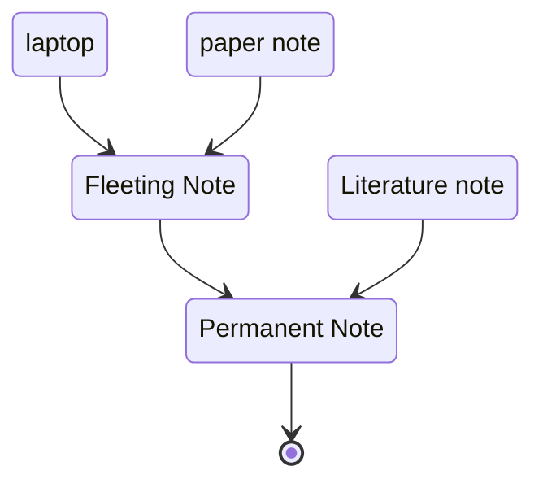

```mermaid
stateDiagram-v2
    state "paper note" as paper
    state "laptop" as laptop
    state "Fleeting Note" as fn
    state "Literature note" as ln
    state "Permanent Note" as pn

laptop --> fn
paper --> fn
fn --> pn
ln --> pn
pn --> [*]
```
